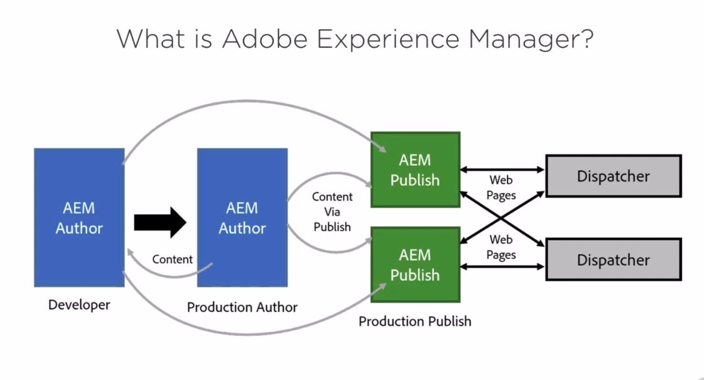
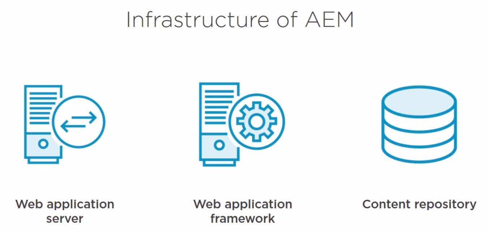
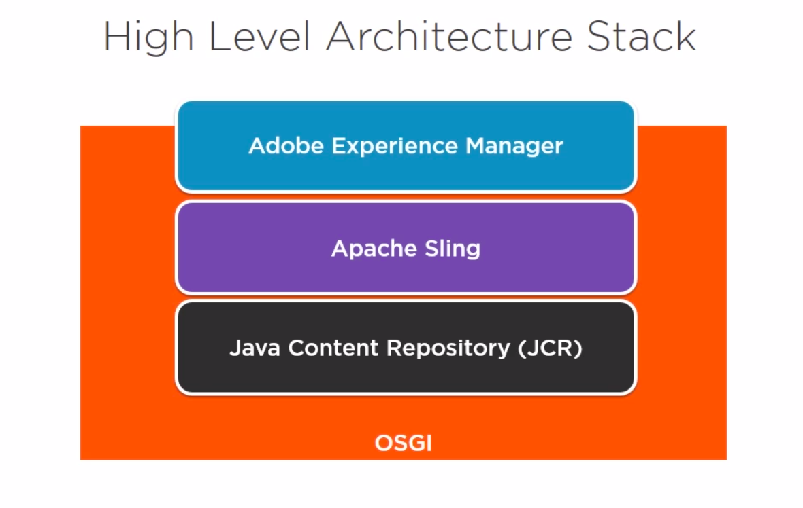
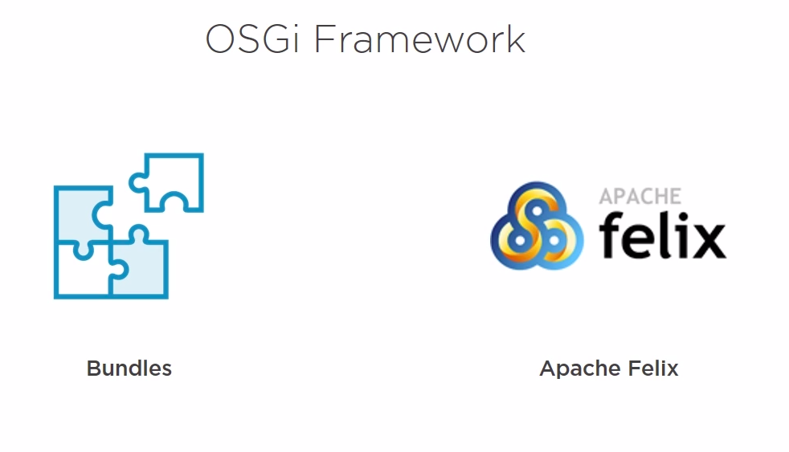
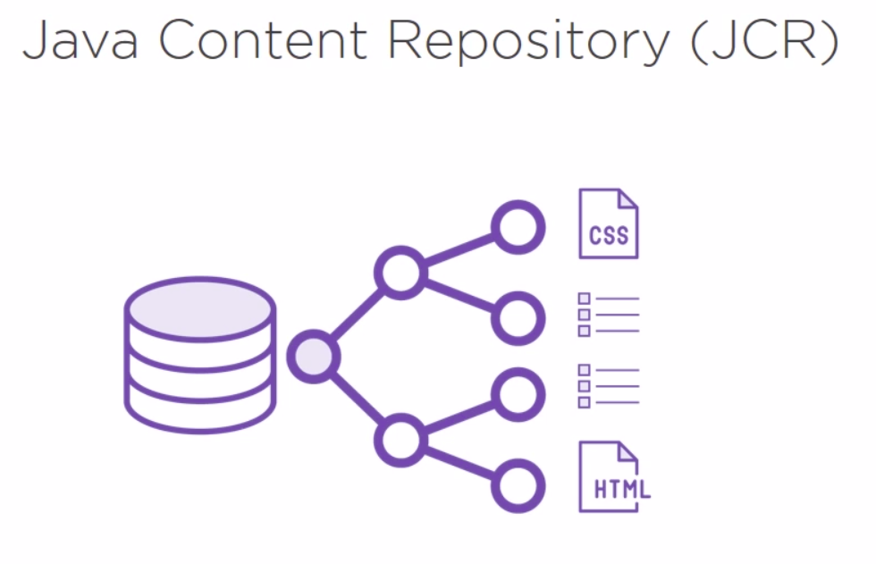

# Architecture and workflow

* Dispatcher: Apeche
* AEM Author, AEM Publish: jar file and license server
# Architeture

1. In standalone mode includes an integrated Jetty web server.
2. AEM also has a web application framework: Sling
  * Sling: simplified the writing of REST content-oriented web applications.
3. Content repository: Jackrabbit OAK
  * OAK: hierarchal database designed specifically for structured and semi-structured data 
# Stack

# Granite
Granite is Adobe's platform for buiilding robust, scalable applications. It supposes an open architecture based on both open standards, which are the JCR and OSGI, and open source projects like Apache Sling and Apache Jackrabbit.
Granite is Adobe's open web stack, and AEM is built on top of the Granite platform.
While Granite is open development, it is not open source.

## Functionality
* Application luncher: quick start for standalone Java applications, or a web application archive for deploying into other servlet containers or application server.
* OSGI framework: Granite also provides us an OSGI framework into which everything is deployed.
* OSGI compendium services for building applications: These are things like logging services, HTTP services, event admin services, and other items of that nature
* Logging framework for various APIs: These APIs includes SLF4j, log4f, Apache Comments logging, and OSGI Log Services.
* JCR API: specification based on Apache Jackrabbit.
* Apache Sling Web Framework

# OSGI Framework:

# JCR

