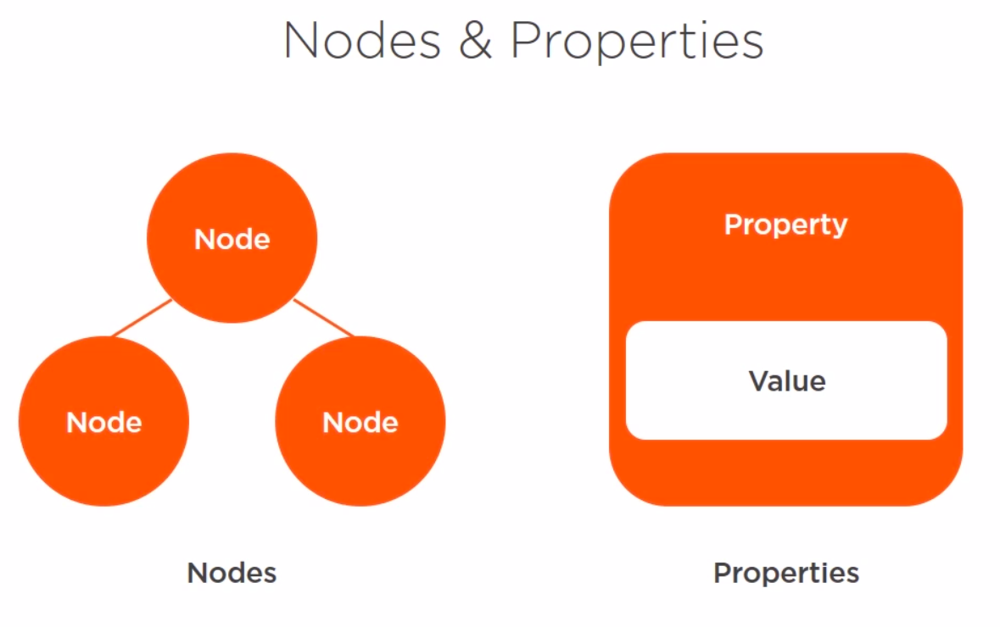
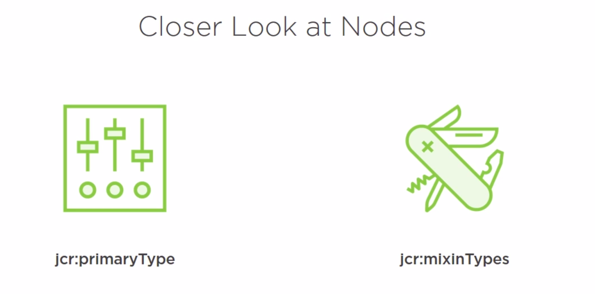
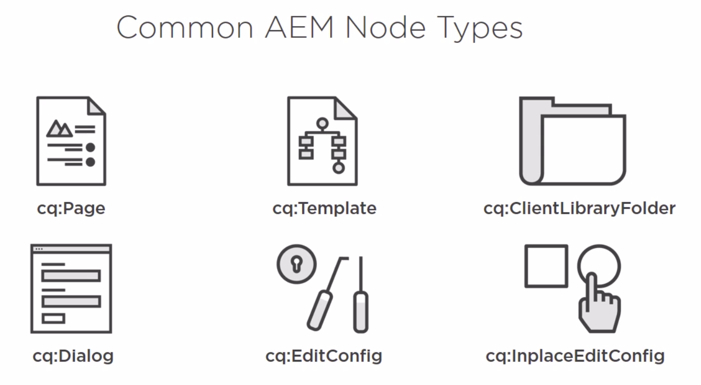
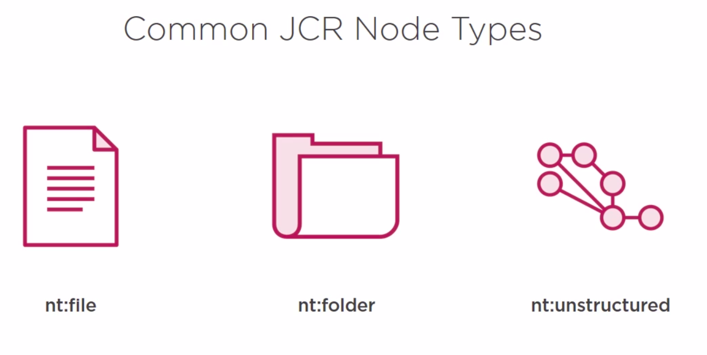

# Introduction

JCR is a hieracrchal structure of two types of items. Nodes and Properties.
## Nodes
Provides a structure in the JCR. Nodes can have a parent and child nodes, and are all rapresented and accessed by path.
## Properties
Can stored the data. All properties have a name and value.

## Namespaces of the nodes

* jcr: basic data storage
* nt: foundation node types
* rep: repository internale
* mix: standard mixin node types
* sling: added by Sling framework
* cq: added by AEM application

## Node types

* nt:file rappresent a files, is in a file-system
* nt:foòder rappresent a foòder, is in a file-system
* nt-unstructured allow any combination of child nodes, allow any combination of properties.
It's support client-orderable child nods, and it used to store unstructured content.

**nt** is a namespaces and really stands for node type

* cq:template define which template is used to create pages
* cq:ClientLibraryFolder these define libraries of client-side javascript and css
* cq:Dialog which define touch-enabled dialog box
* cq:EditConfig defines editing configurations for a component, including drag and drop and in-place editing
* cq:InplaceEditConfig define an in-place editing configuration for a component

