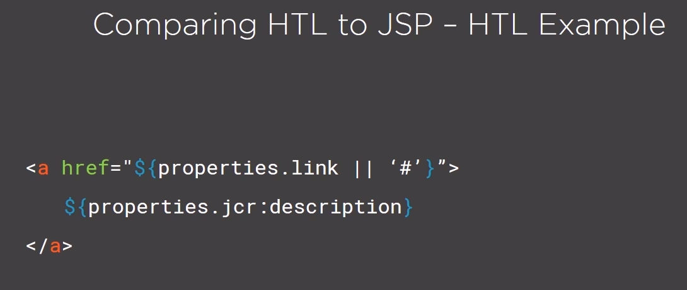

# HTL
Template language developed by Adobe to offer a hightly productive enterprice-level web framework that increases security, and allow HTML developers without Java knowedge to better participate in AEM projects.



## HTL syntax
### Block statements => data-sly-*
  * Sly tag => <sly data-sly-test.varone="${properties.yourProp}" />
    * Use => <div data-sly-use.nav="navigation.js">${nav.foo}</div>
- Examples:
  * Unwrap 
  ```
    <div data-sly-unwrap>
      <p>I'm still rendered.</p>
    </div>
  ```
 * List
 ```
  <dl data-sly-list="${currentPage.listChildren}" >
 ```
 
### Expressions => ${}:
  * ${true}
  * ${42}
  * #### Enumerable objectes => pageProperties, properties, inheritedPageProperties: ${properties.text}
  * #### URI manipulation => ${'example.com/path/page.html' @ scheme='http'}
### Comments => <!--/* An HTL comment */-->

## Globally available Objects
### Enumerable
* properties
* pageProperties
* inheritedPageProperties

### Java Backend
* component
* currentDisign
* currentPage
* currentSession
* request - response
* resource
* wcmmode

# Try on Training project
1. Enter in /apps/training/components/structure/contentpage/contentpage.html
2. erase everything
3. Insert the code:
```
<!doctype html>
<html>
<head>
    <meta charset="utf-8"/>
    </head>
    <body>
    <h1>Hello World!!</h1>
        <h3>Sling PropertiesObject</h3>
<p>Page Title : ${properties.jcr:title}</p>

<h3>Page Details</h3>
<p>currentPage Title: ${currentPage.Title}</p>
<p>currentPage Name: ${currentPage.Name}</p>
<p>currentPage Path: ${currentPage.Path}</p>
<p>currentPage Depth: ${currentPage.Depth}</p>

        <h3> Node Details </h3>
<p>currentNode Name: ${currentNode.Name}</p>
<p>currentNode Path: ${currentNode.Path}</p>
<p>currentNode Depth: ${currentNode.Depth}</p>
    </body>
</html>
```
