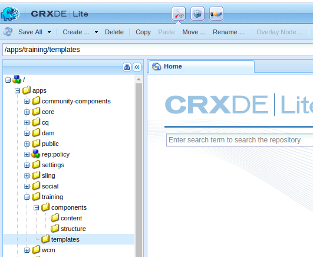
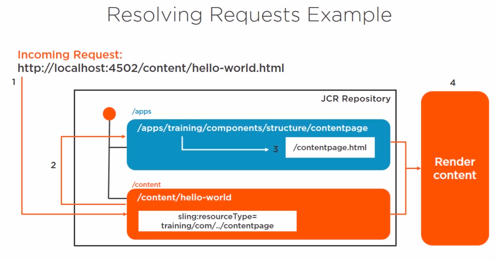

# Scaffolding


# Hello world
1. In components folder create two folder content, for specific components, and structure for structure template
2. In structure create a components with properties like the screenshot

3. Rename contentpage.jsp to contentpage.html with the codes:
```
<!DOCTYPE html>
<html lang="en">
<head>
    <meta charset="UTF-8">
    <title>Training Homepage</title>
</head>
<body>
    <h1>Hello world</h1>
</body>
</html>
```
4. Create templates folder in apps/training
5. In /content folder create nt:unstructured node with name hello-world
6. In hello-world node added property: ```sling:resourceType - String - training/components/structure/contentpage```
7. Go to (hello-world component)[http://localhost:4502/content/hello-world.html]


## Sling resolution

* path is to help to locate it.
* name to identify it
* resourceType which points us to the resource's renderer.

To understanding thie Sling resolution process, just know a URL points to a resource, and this resource tipically live in JCR structure. AEM simple way of processing requests coming in. Each content item in the JCR is expose as an HTTP resource.

So far instance, in our Hello world example our content item was /content/hello-world.
Once the content is determined, the script or servelet to handle the request needs to be determined.


## Decomposing the URL
http://myhost/tools/spy.printable.a4.html/a/b?x=12
* /tools/spy => Content path in JCR to rendering with a selectors
* printable.a4 => Selector(s), [printable, a4]
* /a/b => suffix for specified additional information




