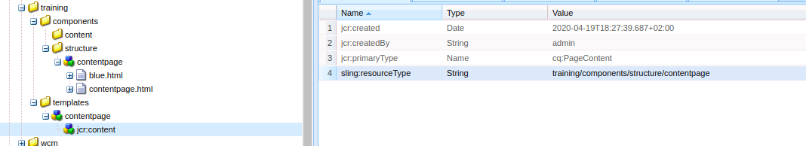

# Template
Template are used for creating pages and for building the intial page content in a jcr:content node tree.

## Training project
1. Go to /apps/training/templates
2. Create template
3. Follow the value field in screenshot

4. Go to http://localhost:4502/sites.html/content > Create > Page
5. Select "Training ContentPage"
6. Complete all fields of the form

## Restrict access

