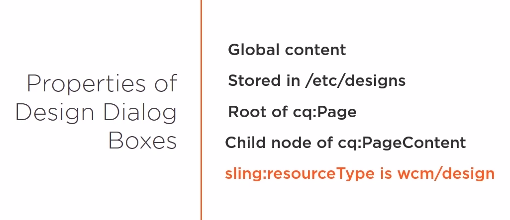
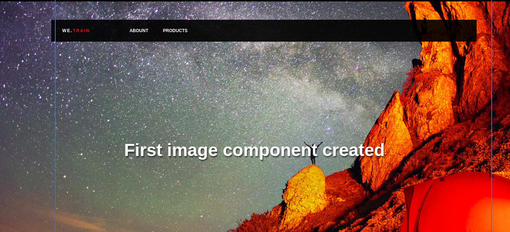
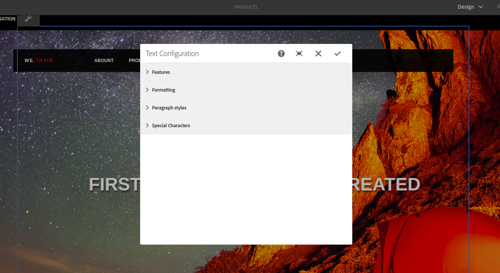
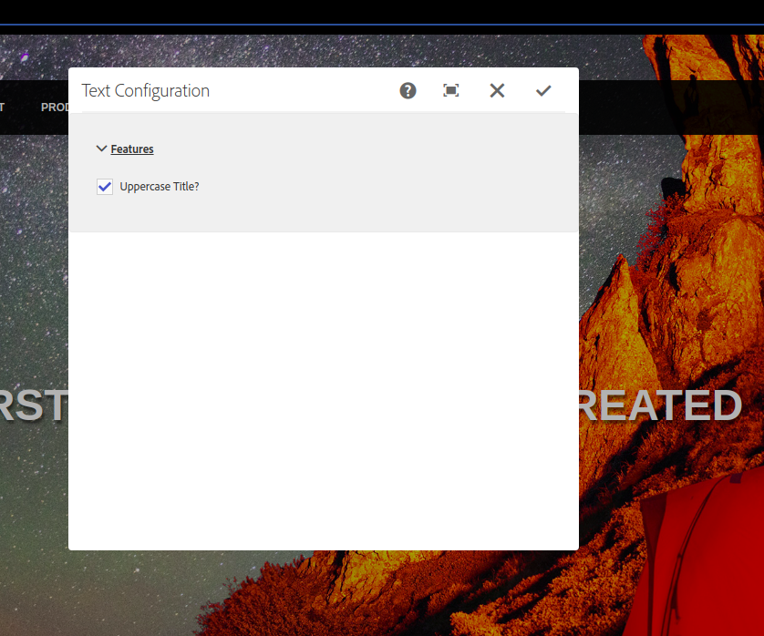

# Design Dialog Boxes

 Content entered into a design dialog box is global content. It's accessible to every page that shares the same design. When interacting with the design dialog, the nodes and properties are stored under etc/designs, instead of the local jcr content node of a particular page. The root node of the design is of type cq:Page just like our normal pages, and if you recall, pages are of type cq:Page, and these must have a child node of cq:PageContent. And finally, the sling:resourceType of a designer is of wcm/design. We can access the designer vales with code by the current style object, which is an AEM global object available to us in HTL. This is different from the properties object that we have been using so far. Design dialog boxes are almost identical to a component dialog box, except they are named cq:design_dialog instead of cq:dialog. 

*Remember, the content when dealing with design dialog boxes is stored under etc/designs, and not in the pages of your particular website.* 



# Create Image component

1. Create a hero component in /apps/training/components/structure

2. Rename file hero.jsp by hero.html and put the code:

   ```html
   <div data-sly-use.hero="hero.js" class="we-HeroImage width-full ratio-16by9" style="${hero.style @ context='styleString'}">
           <div class="container cq-dd-image">
               <div class="we-HeroImage-wrapper">
                   
                   <strong class="we-HeroImage-title">${hero.text}</strong>
   
               </div>
           </div>
       </div>
   ```

3. Create hero.js file and put the code:

   ```javascript
   "use strict";
   use(function() {
       var CONST = {
           PROP_TITLE: "jcr:title",
           PROP_REF_HERO_IMAGE: "fileReference",
           PROP_UPLOAD_HERO_IMAGE: "file"
       }
       
       var hero = {}
       
       //Get the title text
       hero.text = properties.get(CONST.PROP_TITLE)
               || pageProperties.get(CONST.PROP_TITLE)
               || currentPage.name;
   
       
       //Check for file reference from the DAM
       var image = properties.get(CONST.PROP_REF_HERO_IMAGE, String.class);
       if(image == "undefined"){
       	//Check for file upload
       	var res = resource.getChild(CONST.PROP_UPLOAD_HERO_IMAGE);
       	if(res != null){
       		image = res.getPath();
       	}
       }
       
       if(image != "undefined"){
       	hero.style = "background-image:url(" + image + ");";
       }
       
       return hero;
   });
   ```

4. Replace body.html content by:

   ```html
   <div class="container we-Container--main">
   	<div class="root responsivegrid">
   		<div class="aem-Grid aem-Grid--12 aem-Grid--default--12 ">
   			<div class="header aem-GridColumn aem-GridColumn--default--12" data-sly-include="header.html"></div>
   			<div class="hero-image image parbase aem-GridColumn aem-GridColumn--default--12">
   			<div data-sly-resource="${'hero' @resourceType='training/components/structure/hero'}"></div>
   			<div class="responsivegrid aem-GridColumn aem-GridColumn--default--12">
   			<div class="aem-GridColumn aem-GridColumn--default--12">
   				<div class="row">
   				<div class="aembreadcrumb">Breadcrumb</div>
   				<div class="we-Header" data-sly-resource="${'title'@ resourceType='training/components/structure/title'}"></div>
   				<div>Responsive Content Area</div>
   			</div>
   		</div>
   <form class="page__print">
   	<input value="Print Friendly" type="submit" />
   </form>
   <div class="footer aem-GridColumn aem-GridColumn--default--12" data-sly-include="footer.html"></div>
   </div>
   </div>
   </div>
   </div>
   </div>
   ```

5. Copy /libs/wcm/foundation/components/image/cq:dialog node into /apps/training/components/structure/hero

6. Create cq:editConfig node with type cq:EditConfig in  /apps/training/components/structure/hero

7. Create cq:dropTargets node with type nt:unstructured in /apps/training/components/structure/hero/cq:editConfig

8. Create image node with type cq:DropTargetConfig in /apps/training/components/structure/hero/cq:editConfig/cq:dropTargets

9. Add properties:

   1. accept, string[], image/.*
   2. groups, string[], media
   3. propertyNae, string, ./fileReference

   to image node

10. Create parameters node with type nt:unstructured and property sling:resourceType, string, training/components/structure/hero




# Create design dialog box

1. Go to http://localhost:4502/sites.html/content
2. Select Training first-page and click to Properties
3. In Advanced complete Design field with value /etc/designs/training
4. Save & Close and go to http://localhost:4502/editor.html/content/Training/en/products.html and select Design mode instead Edit
5. Copy /libs/foundation/components/text/cq:design_dialog node and paste in /apps/training/components/structure/hero



6. Delete Formatting, Paraformat, Characters nodes from hero component

7. Delete /apps/training/components/structure/hero/cq:design_dialog/content/items/plugins/items/Features/items/uppercase node and create new node uppercase  nt:unstructured

8. Add these properties to uppercase node

   1. name, String, ./uppercase
   2. sling:resourceType, String, granite/ui/components/foundation/form/checkbox
   3. text, String, Uppercase Title?
   4. value, Boolean, true

9. Replace this code 

   ```javascript
   "use strict";
   use(["/libs/wcm/foundation/components/utils/AuthoringUtils.js"], function (AuthoringUtils) {
       var CONST = {
           PROP_TITLE: "jcr:title",
           PROP_REF_HERO_IMAGE: "fileReference",
           PROP_UPLOAD_HERO_IMAGE: "file",
           PROP_UPPERCASE: "uppercase"
       }
       
       var hero = {}
       
       //Get the title text
       hero.text = properties.get(CONST.PROP_TITLE)
               || pageProperties.get(CONST.PROP_TITLE)
               || currentPage.name;
   
       
       //Check for file reference from the DAM
       var image = properties.get(CONST.PROP_REF_HERO_IMAGE, String.class);
       if(image == "undefined"){
       	//Check for file upload
       	var res = resource.getChild("file");
       	if(res != null){
       		image = res.getPath();
       	}
       }
       
       if(image != "undefined"){
       	hero.style = "background-image:url(" + image + ");";
       }
       
       //Add uppercase design to hero text
       if(currentStyle.get(CONST.PROP_UPPERCASE)){
       	hero.uppercase = "text-transform:uppercase;";
       }
       
       
       
       return hero;
   });
   ```

   to hero.js

10. Replace this code

```html
<div data-sly-use.hero="hero.js" class="we-HeroImage width-full ratio-16by9" style="${hero.style @ context='styleString'}">
        <div class="container cq-dd-image">
            <div class="we-HeroImage-wrapper">
                
                <strong class="we-HeroImage-title" style="${hero.uppercase @ context='styleString'}">${hero.text}</strong>

            </div>
        </div>
    </div>
```

to hero.html



 