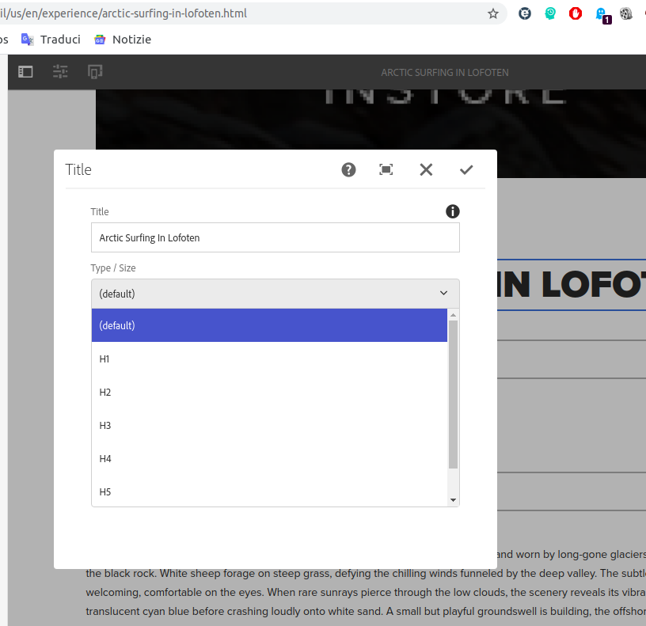
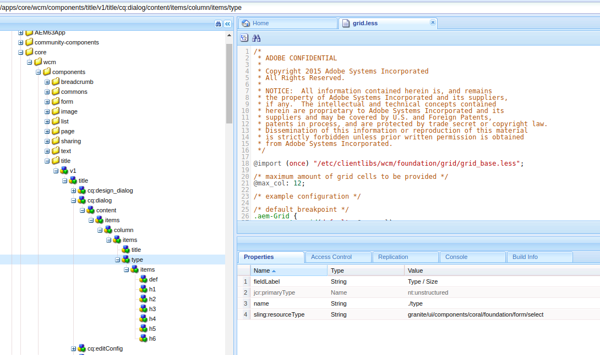

# Dialog Touch Ui


There are two types of dialog boxes available:

* classic 

* touch-optimized, also referred to as Touch UI. 

  The touch-optimized UI makes use of granite. js. 

  All the elements we can use for our dialog boxes are saved in the JCR under libs, granite, UI, components, foundation, form. 

  The root node of a dialog box should extend the base dialog, which is located at cq, gui, components, authoring, dialog. Another great part of AEM is the ability to copy cq:dialog nodes from the foundation components available in libs foundation components. This will help us build our own dialogs. A touch-optimized UI dialog box is defined by using nodes of type nt:unstructured. To define the type of control used, we set the node's sling:resourceType property. 

  




# Create title component

1. In /apps/training/components/structure create a new component title

2. Rename title.jsp by title.html and put into this code ```<h1 data-sly-use.title="title.js">${title.text}</h1>```

3. Create new file title.js with this code 

   ```javascript
   
   "use strict";
   
   use(function () {
   
       var CONST = {
           PROP_TITLE: "jcr:title",
           PROP_TAG_TYPE: "type"
       }
       
       var title = {};
       
       // The actual title content retrieved from the property title
   	// or, the pageProperties title, or, the currentPage.name
       title.text = properties.get(CONST.PROP_TITLE)
               || pageProperties.get(CONST.PROP_TITLE)
               || currentPage.name;
   
       
       return title;
       
   });
   ```

   4. Copy the node /libs/wcm/foundation/components/title/cq:dialog into /apps/training/components/structure/title

   