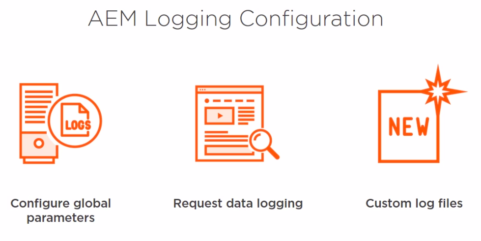

# Logging



Follow the path on the screenshot


1. click "Add new logger" with name training.log and value apps.training and save
2. add ```     log.info("######### (JS) Root page is: " + root.getTitle()); ``` on topnav.js, line 14
3. Render page about or products
4. show in logs directory a training.log file