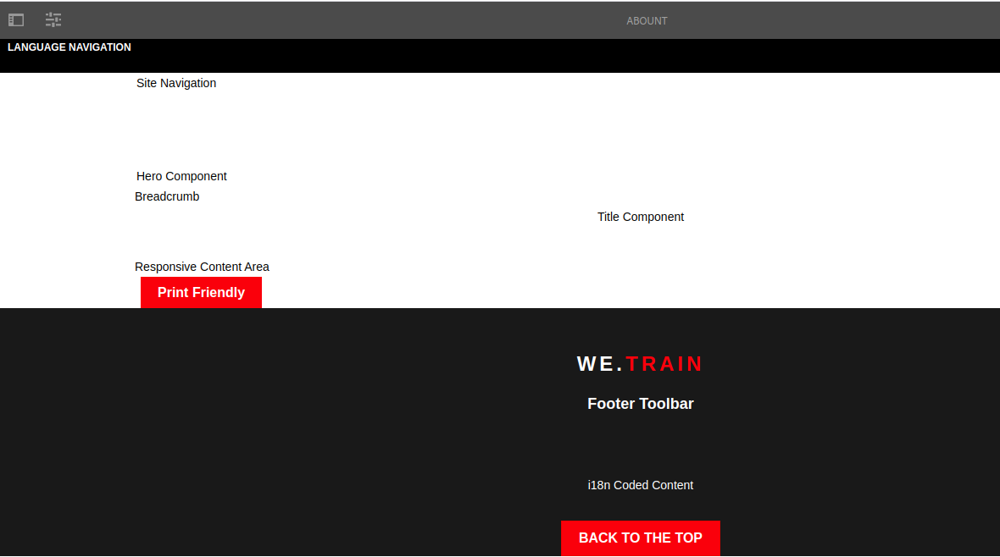
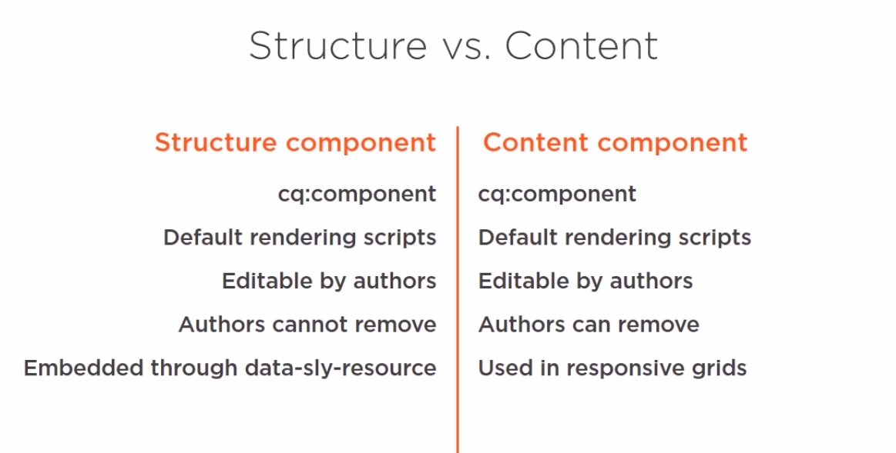
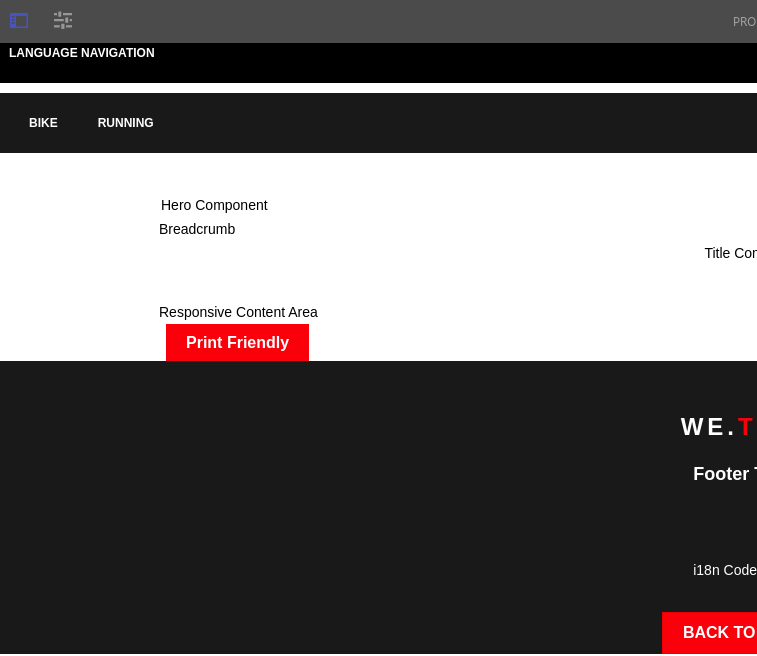

# Stucture Component

1. Create a training node in /etc/designs with property type cq:Page
2. In training node create new node jcr:content with property type PageContent
3. Upload package in design-package.zip
4. Rename folder  with prefix rename_* in /apps/training/temp
5. Move these in /etc/designs/training
6. Insert customfooterlibs.html and customheaderlibs.html in /apps/training/components/structure/contentpage
7. Include customfooter in footer and customheader in header file html



# Structure component vs Content component



# Creating sample top navigation component

1. In /apps/training/components/structure create new component with name: site-top-nav and title Top Navigation

2. Replace extension jsp on file site-topnav with html

3. Inser this code  

   ```html
   <!-- /* Basic mock up code */ -->
   <nav class="navbar navbar-inverse navbar-absolute-top">
       
       <ul class="nav navbar-nav navbar-center">
           <li class="nav navbar-nav navbar-left" data-sly-repeat="${currentPage.listChildren}">
               <a href="${item.path}.html">${item.title}</a>
           </li>
       </ul>
       
   </nav>
   ```

   ref. https://docs.adobe.com/content/help/it-IT/experience-manager-htl/using/htl/block-statements.html#repeat (repeat block statement data-sly-repeat)

   4. Replace this code

      ```html
      <div class="navbar navbar-inverse navbar-fixed-top hidden-xs">
          <div class="container-fluid">
              <nav style="color: white;" >Language Navigation</nav>
              <ul class="nav navbar-nav navbar-right" style="color: white;" >
                  <sly>Toolbar</sly>
              </ul>
          </div>
      </div>
      
      <div data-sly-resource="${'site-topnav' @ resourceType='training/components/structure/site-topnav'}"></div>
      ```

      with content of the header.html file

      

5. Replace the code on /apps/training/components/structure/site-topnav/site-topnav.html by this:

```html
<!-- /* Add the full responsive design */ -->
<div class="container we-Container--top-navbar">
    <nav class="navbar navbar-inverse navbar-absolute-top">
        <div class="navbar-header">
            <button type="button" class="navbar-toggle collapsed" data-toggle="collapse" data-target="#we-example-navbar-collapse-inverse" aria-expanded="false">
                <span class="sr-only">Toggle navigation</span>
                <span class="icon-bar"></span> <span class="icon-bar"></span>
            </button>
            <button type="button" class="navbar-toggle navbar-toggle-close collapsed" data-toggle="collapse" data-target="#we-example-navbar-collapse-inverse" aria-expanded="false">
                <span class="sr-only">Toggle navigation</span>
            </button>
            <a class="navbar-brand" href="#">we.<strong>train</strong></a>
            <div class="pull-right visible-xs"></div>
        </div>

        <!-- /.navbar-header -->
        <div class="collapse navbar-collapse width" id="we-example-navbar-collapse-inverse">
            <ul class="nav navbar-nav navbar-center">
                <li class="visible-xs"><a href="#">we.<strong class="text-primary">train</strong></a></li>
                
                <!-- /* Basic mock up code */ -->
                <li class="nav navbar-nav navbar-left" data-sly-repeat="${currentPage.listChildren}">
                    <a href="${item.path}.html">${item.title}</a>
                </li>

                <li class="visible-xs divider" role="separator"></li>
            </ul>
        </div>
        <span style="height: 0px;" class="navbar-shutter"></span>
    </nav>
    <!-- /.navbar -->
</div>
```

to showing responsive top nav