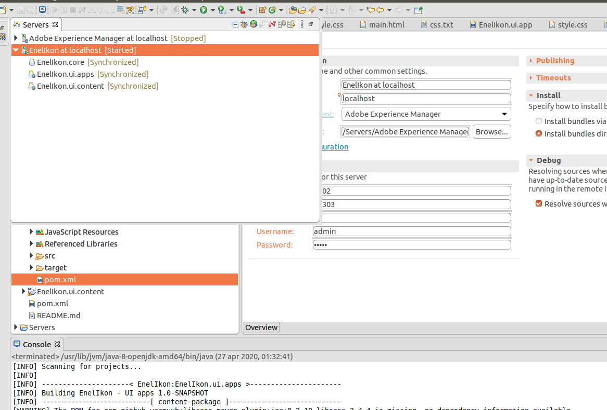

# Creating an Adobe Experience Manager 6.3 Project using Adobe Maven Archetype 11

After you will setup Maven in your development environment (ref. [quick-starter-configuration](./quick-starter-configuration))

1. Run the following Maven command:

   ```bash
   mvn org.apache.maven.plugins:maven-archetype-plugin:2.4:generate -DarchetypeGroupId=com.adobe.granite.archetypes -DarchetypeArtifactId=aem-project-archetype -DarchetypeVersion=11 -DarchetypeCatalog=https://repo.adobe.com/nexus/content/groups/public/
   ```

2. When prompted, specify the following information:
   * **groupId** - AEM63App
   * **artifactId** - AEM63App
   * **version** - 1.0-SNAPSHOT
   * **package** - com.aem.community
   * **appsFolderName** - AEM63App
   * **artifactName** - AEM63App
   * **componentGroupName** - AEM63App
   * **contentFolderName** - AEM63App
   * **cssId** - AEM63App
   * **packageGroup** - AEM63App
   * **siteName** - AEM63App
3. WHen prompted, specify **Y**.
4. Once done, you will see a message like:

```bash
[INFO] Parent element not overwritten in /home/sandro/DsTech/java/AEM jar/EnelIkon/it.tests/pom.xml
[INFO] Parent element not overwritten in /home/sandro/DsTech/java/AEM jar/EnelIkon/it.launcher/pom.xml
[INFO] project created from Archetype in dir: /home/sandro/DsTech/java/AEM jar/EnelIkon
[INFO] ------------------------------------------------------------------------
[INFO] BUILD SUCCESS
[INFO] ------------------------------------------------------------------------
[INFO] Total time:  31.915 s
[INFO] Finished at: 2020-04-25T19:26:46+02:00
[INFO] ------------------------------------------------------------------------
```

5. Change the working directory to AEM63App and then enter the following command. ```mvn eclipse:eclipse```

6. Open Eclipse, go to File>Import>Maven>Existing Maven Projects, select AEM63App created

   After you import the project into Eclipse, notice each module is a separate Eclipse project:

   

   - **core** - where Java files that are used in OSGi services and sling servlets are located

   - **launcher** - where additional Java files are located

   - **tests** - Java files for tests like JUNIT tests

   - **apps** - content under /apps

   - **content** - content under /content

# Build the OSGi bundle using Maven

To build the OSGi bundle by using Maven, perform these steps:

1. Run command ```mvn -PautoInstallPackage -Padobe-public clean install``` in  AEM63App folder
2. Verify your package installing on http://localhost:4502/system/console/bundles, select OSGi and search AEM63App
3. Create new server and configure it

