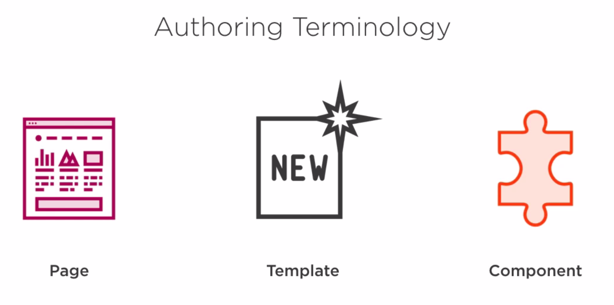
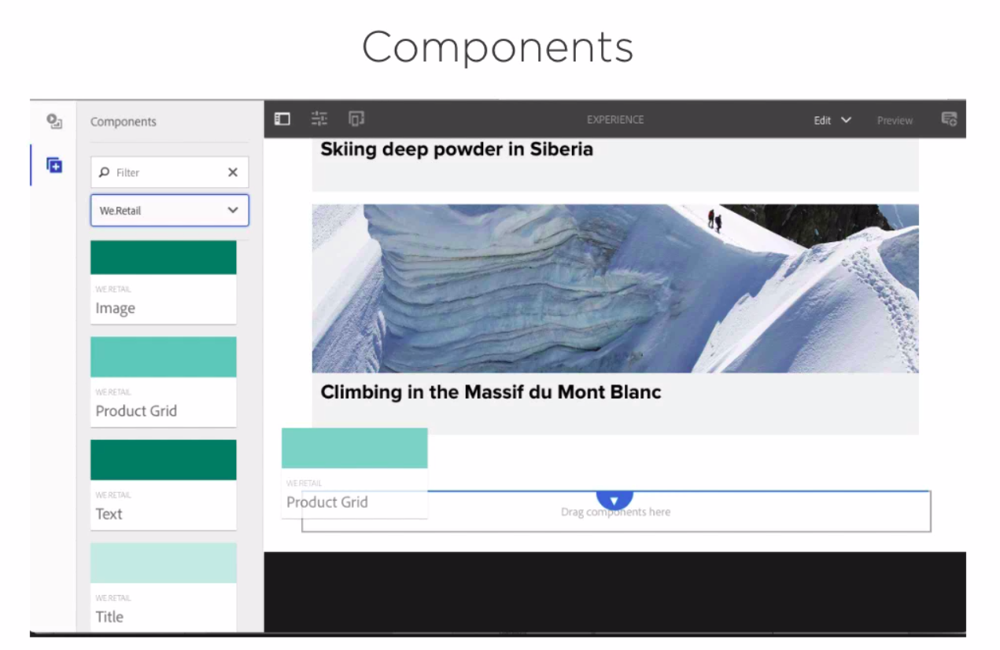
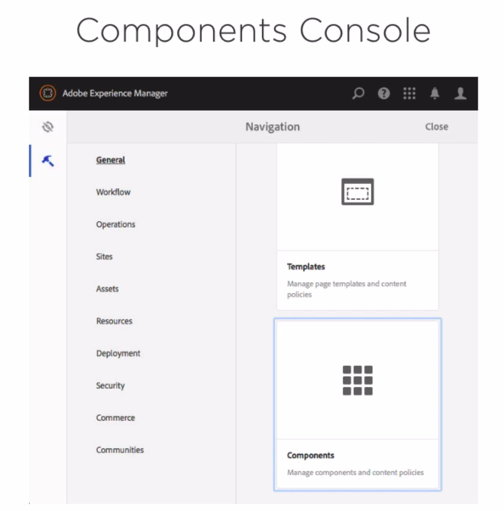
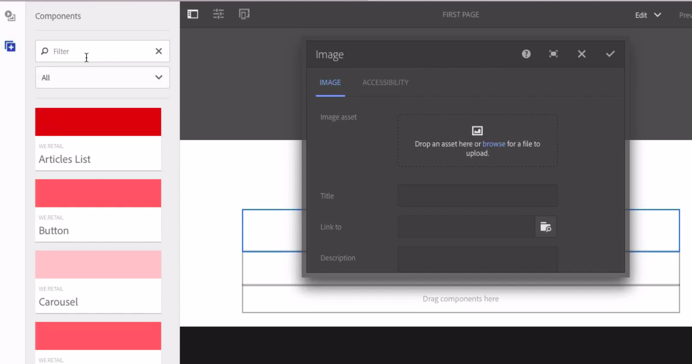

# Authoring skills
Thi illustration rappresent the main keyword for authoring instance

## Compoents

they are configurable via components console

## Create pages
* enter in the sites
* show as view cards properties 
* click create button and then pages
* select template specified
* complete form with title, name, tags properties
* in advance choose a alias

